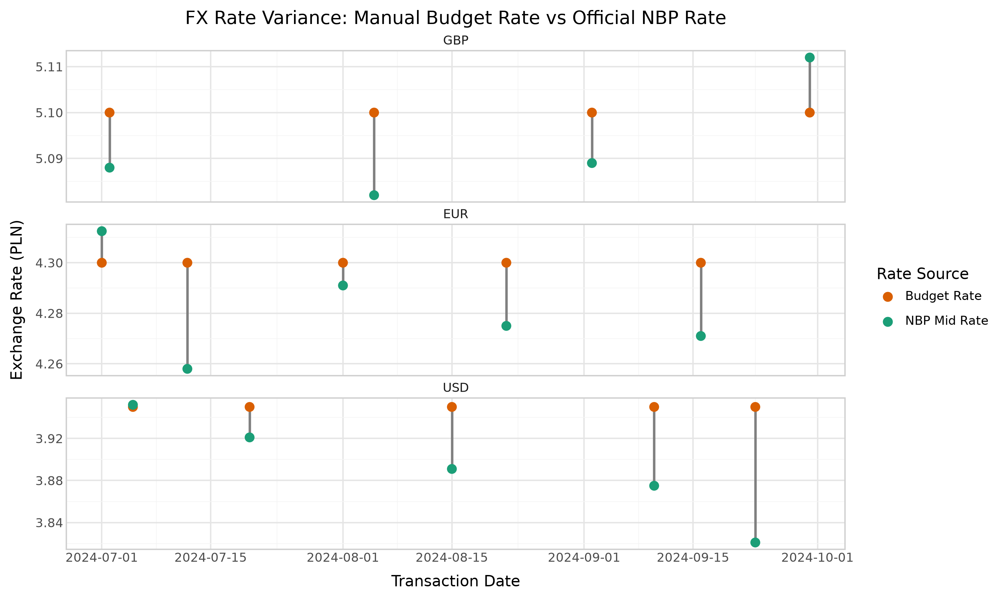

# Project Overview

### Objective
Apply core methodologies from "The Art of Data Science" by Roger D. Peng and Elizabeth Matsui to construct an engineering-grade financial reconciliation pipeline.

### Description
Analyze the financial variance between manual FX rate inputs in ERP/budget systems and official automated exchange rates published by the National Bank of Poland (NBP - Narodowy Bank Polski).

### Stack
| Technology |
| :--- |
| Python |
| Pandas |
| plotnine (ggplot) |

---

### Key Findings & Visualization

### Conclusion
Manual FX rate entries introduce significant operational variance compared to official central bank rates:
* Mean Absolute Deviation (MAD): 1,919.25 PLN per transaction.
* Relative Impact: Manual rate discrepancies account for an average error of 2.03% per transaction value (when treating the value actually traded as the transaction value).

---

### Project Structure
    ├── data/
    │   ├── raw/
    │   │   ├── nbp_rates_q3_2024.csv
    │   │   └── transactions_q3_2024.csv
    │   └── clean/
    │       └── transactions_matched.csv
    ├── outputs/
    │   └── fx_variance_dumbbell.png
    ├── src/
    │   └── fx_reconciliation.py
    └── README.md
---
*Note: All data used in this project was synthetically generated for demonstration and testing purposes.*
